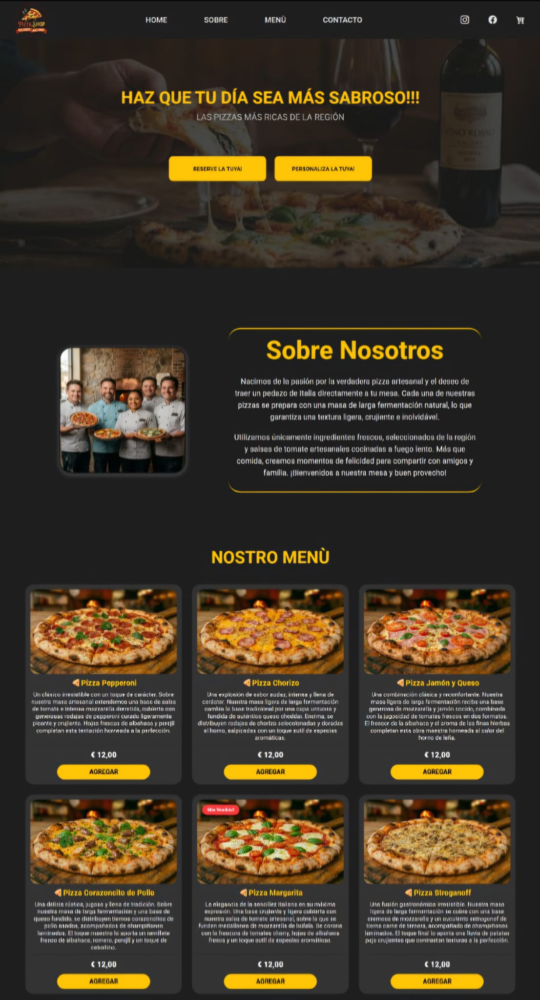

# 🍕 PizzaShop 

## PizzaShop es la landing page de una pizzería artesanal italiana con estilo moderno.

## 📸 Demostración:

  

- 🔗 [Mira el proyecto completo aquí](https://github.io)

## 🚀 Tecnologías

- *HTML5* (Semántica y Accesibilidad)
- *CSS3* (Variables nativas, CSS Grid, Flexbox y animaciones de transición)
- *JavaScript* (Animación de Menú Hamburguesa)
- *Git y GitHub* (Control de versiones)

## 📚 Integraciones y Librerías

- *Google Fonts* (Tipografías Roboto / Poppins)
- *Bootstrap Icons* (Íconos interactivos de redes sociales y carrito)
- *Flaticon* (Favicon)

## ⚙️ Metodologías y Deploy

- Metodología BEM (arquitectura CSS)
- Hosting mediante GitHub Pages

## 💻 Proyecto

*PizzaShop* es una aplicación web interactiva diseñada para una pizzería artesanal italiana de estilo moderno. El proyecto fue construido con un fuerte enfoque en la *experiencia del usuario (UX)*, aplicando un diseño en modo oscuro (dark mode) con un contraste vibrante de colores, tipografía limpia y efectos visuales modernos.

### ✨ Características Destacadas:
- *Estructura 100% Semántica:* Uso avanzado de etiquetas HTML5 (`<article>`, `<figure>`, `<time>`) para garantizar accesibilidad y SEO.
- *Diseño Responsivo:* Galería de productos estructurada con *CSS Grid* y Flexbox, adaptándose perfectamente a pantallas de móviles y ordenadores.
- *Interactividad Avanzada:* Efectos de iluminación (glow shadow) en botones, íconos de redes sociales y un sistema dinámico de hover que eleva los componentes visuales.
- *Navegación Fluida:* Control de anclajes de links con compensación de altura (scroll-margin-top) para respetar el encabezado fijo (fixed header).

## 💡 Aprendizajes y Optimizaciones

- **Diseño Gráfico (UI/UX):** Creación y desarrollo de la identidad visual y el logotipo exclusivo de la marca para la landing page.
- **Internacionalización (i18n):** Corrección y adaptación cultural de términos en el menú del español de *"Nostro menú"* a *"Nuestra carta"*, garantizando la expresión correcta para el idioma.
- **Rendimiento (Performance):** Optimización de las imágenes del repositorio, reduciendo el peso visual de archivos en MB a ~200 KB para lograr un renderizado e inicio de carga instantáneo.

## 📈 Próximas Mejoras

### 🧠 Funcionalidades planificadas para el Proyecto:

- Implementación de *JavaScript Vanilla* para dar vida al botón "Agregar".
- Creación de la lógica del *Carrito de Compras* (calcular totales, sumar/restar cantidades y persistencia de datos).

---

## 👤 Autor

✨ Desarrollado con 💜 por Daniela Tenório

- 📫 Contacto: `danniela.tenorio91@gmail.com`
- 🔗 Conéctate conmigo en: [LinkedIn](https://linkedin.com)